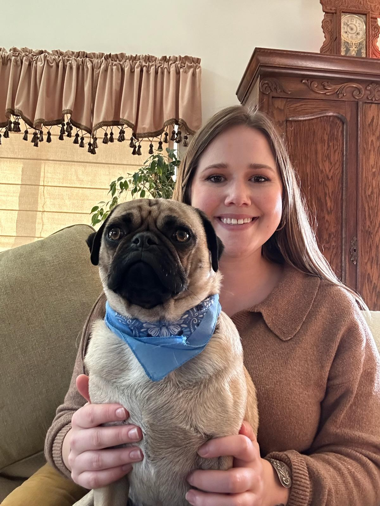

# Genome Biology 
## Fall 2024 Genome Biology seminar

#### My name is Emily Bierbaum, and I am a 5th year PhD student in Dr. Bonett's lab studying the impact of life cycles on salamanders. Check out the lab website below:
[Bonett Lab's Website](https://ronbonett.weebly.com/people.html)
🦎 🐈 🐸
## Project Proposal
[Bierbaum proposal](Proposal.pdf)

## This is the home for all of my work for my favorite class!
### Day 1
#### We dove into genome and sequencing basics. The scripts are below: 
- [sbatch file](https://github.com/EmilyBierbaum/Genome_Biology/blob/main/test.sbatch)
- [sh file](https://github.com/EmilyBierbaum/Genome_Biology/blob/main/test.sh)

## Genomic Adventure Time
## Chapter Two
#### We learned more about uploading and managing files on the super computer and activated the class environment with the notorious MAMBA.
#### Task 1 evaluated the quality of Illumina data and created FastQC output reports
- [e.coli fastqc sh](https://github.com/EmilyBierbaum/Genome_Biology/blob/main/ecoli_fastqc.sh)  
- [e.coli sbatch file](https://github.com/EmilyBierbaum/Genome_Biology/blob/main/ecoli_fastqc.sbatch)  
- [Read 1 fastqc report](read_1_fastqc.html)   
- [Read 2 fastqc report](read_2_fastqc.html)   

#### Task 2 was for sequence data quality control and adaptor trimming. We filtered low quality reads with Trim Galore!
- [e.coli trim sbatch](ecoli_trim.sbatch) 
- [e.coli sh](ecoli_trim.sh) 

#### Task 3 discussed random sub-sampling and digital normalization via ChatGPT 😉
- No script or sbatch files 

#### Task 4 introduced how to align Illumina data to a reference sequence 
- No script or sbatch files 

#### Task 5 created a reference index. But first, we needed to index the genome sequence with BWA! Not feeling confident enough to try minimap2 yet.
- [e.coli index sbatch](ecoli_index.sbatch) 
- [e.coli index sh](ecoli_index.sh)  

#### Task 6 aligned read_1 and read_2 to the reference genome. In the end, we succesfully mapped the reads to the reference genome!
 - [e.coli bwa mem sbatch](ecoli_bwa_mem.sbatch)
 - [ecoli bwa mem sh](ecoli_bwa_mem.sh) 

#### Task 7 manipulated the SAM file and converted it to a BAM file, then we sorted the BAM file
- [e.coli samtools sbatch](ecoli_samtools_view.sbatch)
- [e.coli samtools sh](ecoli_samtools_view.sh)
- [e. coli map sort sbatch](ecoli_map_sort.sbatch)
- [e.coli map sort sh](ecoli_map_sort.sh)

#### Task 8 removed PCR duplicates with samtools. We started by sorting the BAM file by read name then added tags. After we resorted by chromosomal position. Finally we marked duplicates and removed them.
- [e.coli markdup sbatch](ecoli_markdup.sbatch)
- [ecoli markdup sh](ecoli_markdup.sh)
- [e.coli samstool index sbatch](ecoli_samtools_index.sbatch)
- [e.coli samstool index sh](ecoli_samtools_index.sh)
#### Task 9 mapped statistics, and produced an output file. We cleaned up extra files (I entered these directly into the terminal but included them below)
- [e.coli samtools flagstat sbatch](ecoli_samtools_flagstat.sbatch)
- [e.coli samtools flagstat sh](ecoli_samtools_flagstat.sh)
- [mapping stats output file](mappingstats.txt)
- [e.coli cleanup commands](ecoli_rm_files.sh)

#### Task 10 we used QualiMap to summarize the mapped alignment in greater detail. This produced an html output file.
- [e.coli qualimap sbatch](qualimap_ecoli.sbatch)
- [e.coli qualimap sh](qualimap_ecoli.sh)
- [QualiMap output file](qualimapReport.html)

#### Task 11 gave a graphical view of the alignments 
- No script or sbatch files
- We imported our E. coli reference sequence, annotation, and BAM alignment, to examine the coverage of the read pairs.

#### Task 12 evaluated SNPs and indels
- No scripts or sbatch files
- Further explored the IGV program 

#### Task 13 identified SNPs and indels manually
- No scripts or sbatch files
- Do NOT try to manually identify SNPs and Indels... too tedious 

#### Task 14 automated variant calling (predicting) with the package bcftools. We generated a pileup file that contains locations with the variants. Next we called again what bcftools thinks are the variant sites, then assumed the variants a ploidy of one. We then created a VCF file that can be loaded into IGV. 
- [e.coli vcf sbatch](ecoli_vcf.sbatch)
- [e.coli vcf sh](ecoli_vcf.sh)
- [e.coli call sbatch](ecoli_call.sbatch)
- [e.coli call sh](ecoli_call.sbatch)
- [e.coli filt sbatch](ecoli_filt.sbatch)
- [e.coli filt sh](ecoli_filt.sh)

#### Task 15 located genes that are missing compared to the reference with the program BEDTools. It took a lot of blood, sweat, and tears but we completed the first part of the adventure. 😢
- [e.ecoli cover sbatch](ecoli_cover.sbatch)
- [e.coli cover sh](ecoli_cover.sh)

#### Duncan and I 🫶 --- Cute pic stop before Chapter 3 Genome Adventure ⛰️

## Genomic Adventure Time x2
## Chapter Three
#### Task 1 we extracted the UNmapped reads, that did not map to the assembly. We then converted them from bam to fastq.
- [bam to fastq sbatch](bam_to_fasta.sbatch)
- [bam to fasta sh](bam_tofasta.sh)

#### Task 2 we checked the number of entired and headers for the two read fastq files produced. I used the `cat commands`. Then I repurposed the fastqc program sbatch and sh file to evaluate the QC.
- [unmapped fastq sbatch](unmapped_fastqc.sbatch)
- [unmapped fastqc sh](unmapped_fastqc.sh)
  Check 'em out:
- [Read 1 unmapped fastqc report](unmapped_r1_fastqc.html)
- [Read 2 unmapped fastqc report](unmapped_r2_fastqc.html)
